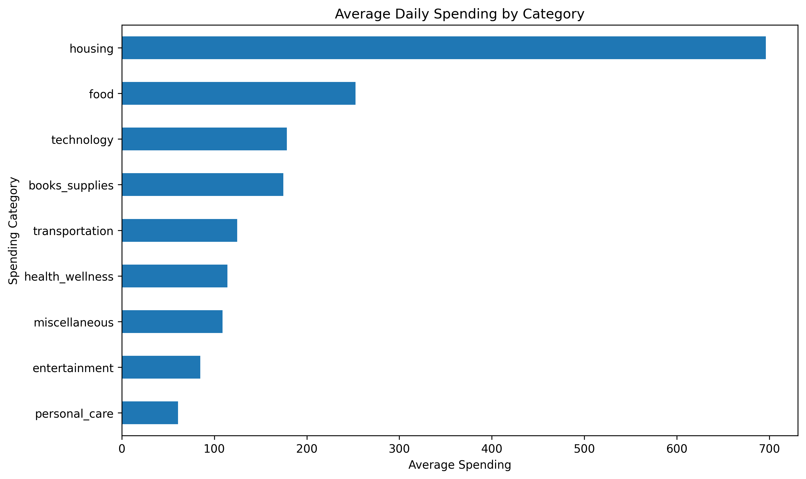
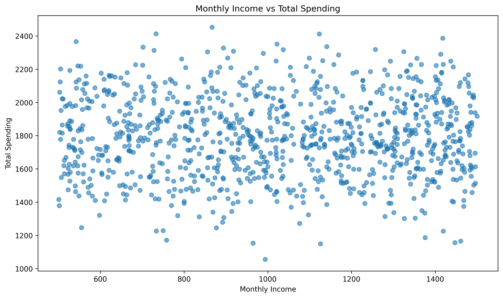
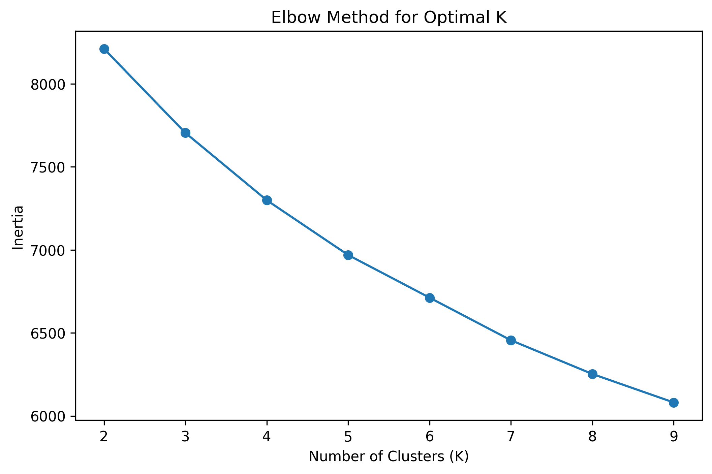
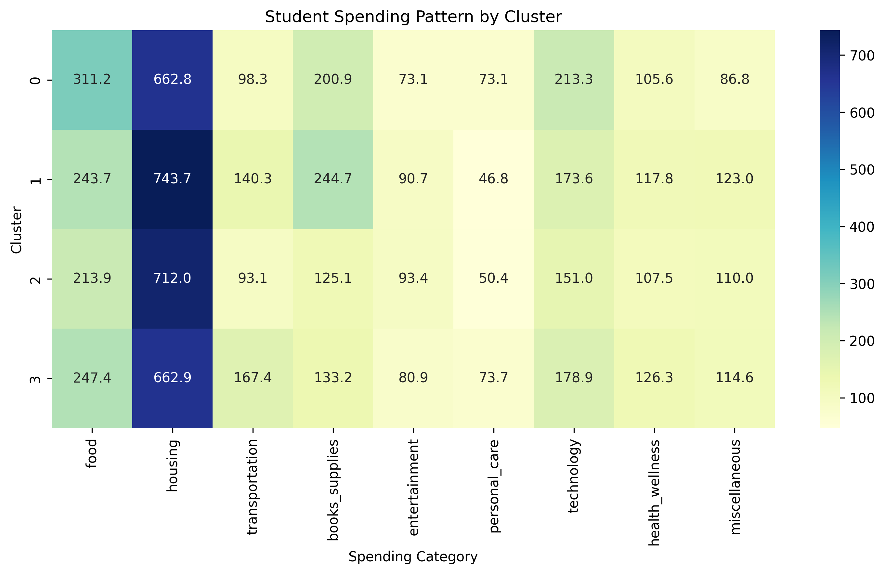
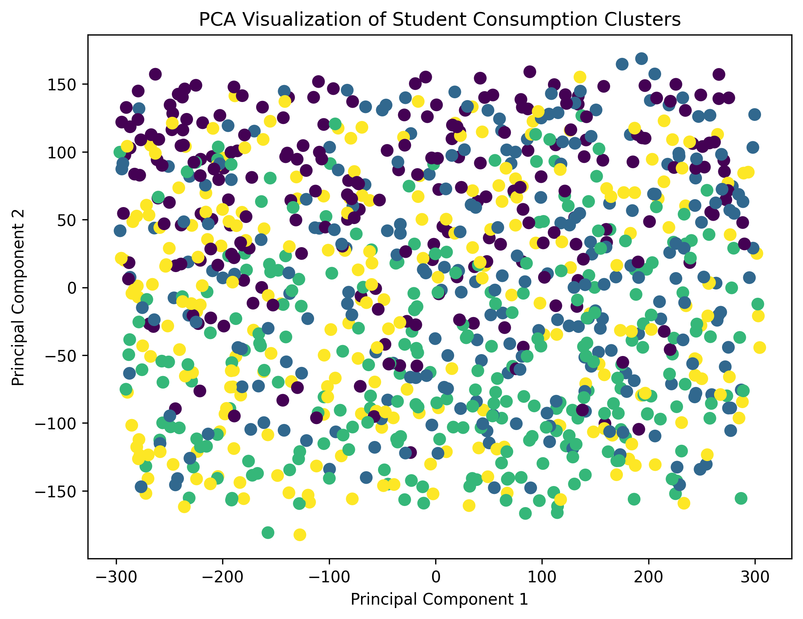

# 大学生消费行为分析与用户画像构建

## 项目简介

本项目基于大学生消费数据，使用 Python 对学生消费结构、影响因素以及消费群体特征进行分析。

主要完成：

- 数据清洗与探索性分析（EDA）
- 消费结构分析
- 相关性分析
- 单因素方差分析（ANOVA）
- KMeans聚类构建学生消费画像
- PCA降维实现聚类结果可视化

---

# 1. 数据集介绍

数据包含1000名大学生消费记录，共18个变量。

主要字段：

- 年龄（age）
- 性别（gender）
- 年级（year_in_school）
- 专业（major）
- 月收入（monthly_income）
- 各类消费支出

消费特征包括：

- 食品消费
- 住房消费
- 交通消费
- 学习用品消费
- 娱乐消费
- 科技消费
- 健康消费等

---

# 2. 探索性数据分析（EDA）

## 各类别平均消费

## 收入与消费关系分析

---

# 3. 统计分析

## 收入与消费相关性分析

通过 Pearson 相关分析研究收入与消费水平之间关系。

## 年级消费差异分析

采用单因素方差分析（ANOVA）：

结果：

- F-statistic = 2.947
- p-value = 0.032

说明不同年级学生消费水平存在统计差异。

---

# 4. 消费群体聚类分析

采用 KMeans 聚类算法，根据学生消费结构划分消费群体。

## 最优聚类数量选择

使用肘部法确定聚类数量：

最终选择：
k=4

---

# 5. 消费画像分析

不同类别学生消费特征：

聚类结果：

- Cluster 0：食品消费较高型
- Cluster 1：学习及住房投入型
- Cluster 2：整体低消费型
- Cluster 3：交通消费偏高型

---

# 6. PCA二维可视化

使用 PCA 对9维消费特征进行降维，将聚类结果展示在二维空间。

---

# 7. 技术栈

Python

- Pandas
- NumPy
- Matplotlib
- Seaborn
- Scikit-learn

算法：

- Pearson相关分析
- ANOVA方差分析
- KMeans聚类
- PCA降维

---

# 8. 项目结构
college-student-consumption-analysis

├── data
│ └── student_spending.csv

├── images
│ ├── daily_spending.png
│ ├── income_vs_spending.png
│ ├── elbow_method.png
│ ├── cluster_heatmap.png
│ └── pca_cluster.png

├── analysis.py

└── requirements.txt

---

# Author

Python Data Analysis Project
